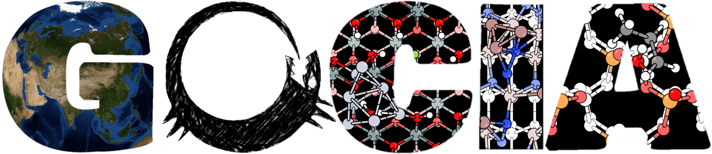

# G O C I A

**G**lobal **O**ptimizer for **C**lusters, **I**nterfaces, and **A**dsorbates

```GOCIA``` is a global optimization toolkit and Python modules specialized for sampling supported clusters, restructured interfaces and adsorbate configurations.

Copyright © 2020 Zisheng Zhang

## Requirements

- Python 3.6 or later
- NumPy
- SciPy
- ASE

