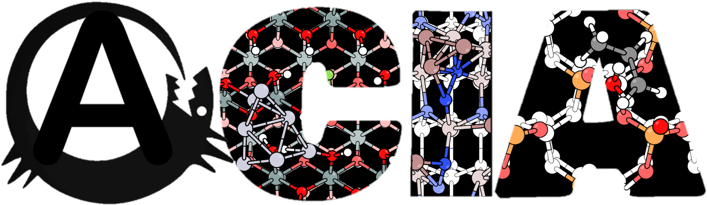

# G A C I A

**G**enetic **A**lgorithm for **C**lusters, **I**nterfaces, and **A**dsorption

```GAIA``` is a genetic algorithm toolkit and Python modules specialized for simulating restructured and adsorbate-covered surfaces.

## Requirements

- Python 3.6 or later
- NumPy
- SciPy
- ASE

